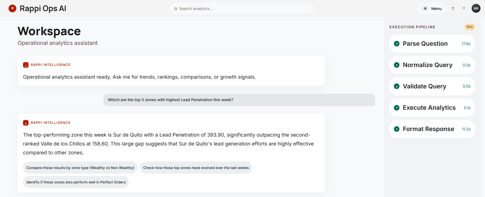
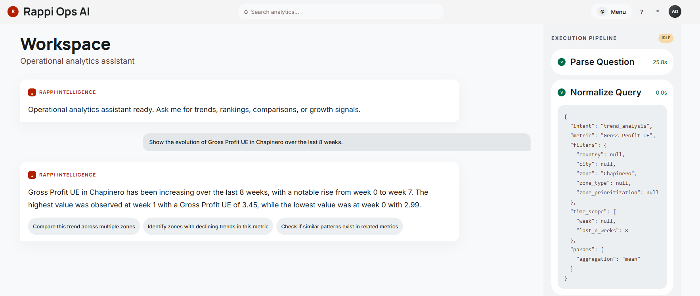
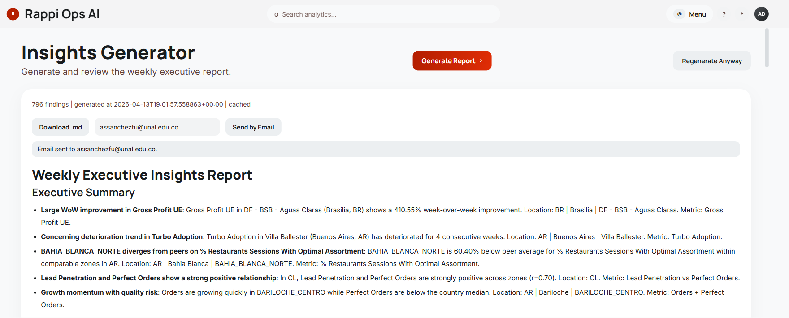

# Rappi Ops AI
Natural-language analytics + automatic executive insights, built with deterministic computation and strict validation.

## One-line summary
This system turns questions into structured analytics queries, computes answers deterministically, and generates executive-ready insights reports.

## Why this matters
- Operations teams ask questions in natural language, but decisions need deterministic math.
- LLMs are useful for interpretation, not for computation.
- This architecture keeps outputs explainable, controllable, and demo-safe.

## What it does
1. **Conversational Analytics**
   - Query operational data with natural language.
   - Get deterministic results for rankings, trends, comparisons, and growth.
2. **Automatic Insights Engine**
   - Detects meaningful signals from normalized data.
   - Produces a curated executive report in Markdown.

## Architecture

### Conversational Analytics Pipeline
`User -> Context Awareness -> Parser (LLM) -> Normalizer -> Validator (Pydantic) -> Executor (Pandas) -> Response Formatter -> Suggestions`

### Insights Engine
`Data -> Deterministic Detectors -> Curation Layer -> Report Generator (LLM) -> Markdown Report`

## Product screenshots
To keep these visuals versioned in the repo, place the image files in `docs/screenshots/` using the exact names below.

### 1) Workspace and conversational analytics


### 2) Trend analysis response with follow-up suggestions


### 3) Executive insights report generator output


## Design philosophy
> **LLMs interpret. Deterministic systems compute.**

- **LLM parser**: converts language into structured JSON.
- **Pydantic schemas**: enforce strict contracts per intent.
- **Pandas execution layer**: computes all analytics deterministically.
- **Insights engine**: detects and ranks findings with deterministic rules, then LLM only writes the final narrative.
- **Result**: low hallucination risk, high control, high explainability.

## Core capabilities
- Top-N rankings
- Aggregations
- Trend analysis
- Group comparisons
- Multi-variable filters
- Growth analysis

## Smart features
- **Conversational memory** for follow-ups (`"What about in Mexico?"`, `"Only Wealthy zones."`)
- **Proactive suggestions** (next-step chips after each answer)
- **Business context awareness** (rule-based enrichment for shorthand business terms)

## Insights engine
Detectors include:
- **Anomalies** (week-over-week changes)
- **Concerning trends** (3+ consecutive deterioration)
- **Benchmarking** (peer divergence)
- **Correlations** (selected metric-pair relationships)
- **Opportunities** (actionable upside heuristics)

Quality layer includes:
- Anomaly sanity filtering (baseline thresholds + sign-flip handling)
- Confidence scoring for anomalies
- Metric-aware “why it matters”
- Deterministic, specific recommendations
- Curated output (not a detector dump)

## How to run

### 1) Install dependencies
```bash
pip install -r requirements.txt
```

If your local file is still named `requeriments.txt`, use:
```bash
pip install -r requeriments.txt
```

### 2) Configure `.env`
Create/update `.env` in project root:

```env
# LLM (OpenAI-compatible; local model supported)
LLM_PROVIDER=local_openai_compatible
OPENAI_API_KEY=local-dev-key
OPENAI_BASE_URL=http://localhost:11434/v1
OPENAI_MODEL=llama3.1

# Optional formatter/report overrides
OPENAI_FORMATTER_MODEL=llama3.1
INSIGHTS_REPORT_MODEL=llama3.1
FORMATTER_TEMPERATURE=0
INSIGHTS_REPORT_TEMPERATURE=0

# Optional SMTP (only if using report email send)
SMTP_HOST=smtp.gmail.com
SMTP_PORT=587
SMTP_USERNAME=you@example.com
SMTP_PASSWORD=your_app_password
SMTP_FROM=you@example.com
SMTP_USE_TLS=1
```

### 3) Run API app
```bash
python -m uvicorn app.api.main:app --host 0.0.0.0 --port 8000 --reload
``` 

### 4) (Optional) Run a direct conversational test
```bash
python scripts/test_direct_line.py --question "What is the average Lead Penetration by country?"
```

### 5) (Optional) Generate executive insights report
```bash
python scripts/generate_insights_report.py
```


## Example usage
Questions:
- “Which are the top 5 zones with highest Lead Penetration this week?”
- “Compare Perfect Orders between Wealthy and Non Wealthy in Mexico.”
- “Show the evolution of Gross Profit UE in Chapinero over the last 8 weeks.”
- “Which zones are growing fastest in orders over the last 5 weeks?”

Outputs:
- Structured validated query
- Deterministic execution result
- Business-friendly response
- Follow-up suggestion chips

## Limitations
- **Business context awareness is partial.**
- Current implementation is **rule-based keyword matching**.
- Shorthand queries like “problematic zones” are improved, but not fully reliable in all semantic variants.
- Better path: map business semantics to explicit structured query templates with stronger intent constraints.

## Future work
- Stronger semantic context layer (template library + confidence scoring)
- Multi-user session-scoped memory (instead of process-global)
- Suggestion personalization by prior interaction path
- Lightweight observability dashboard for parser/validator/executor error categories
- Better multilingual business-term coverage

## Closing note
This project is intentionally opinionated: language is flexible, computation is strict.  
That tradeoff makes the system practical for real operational decisions.
